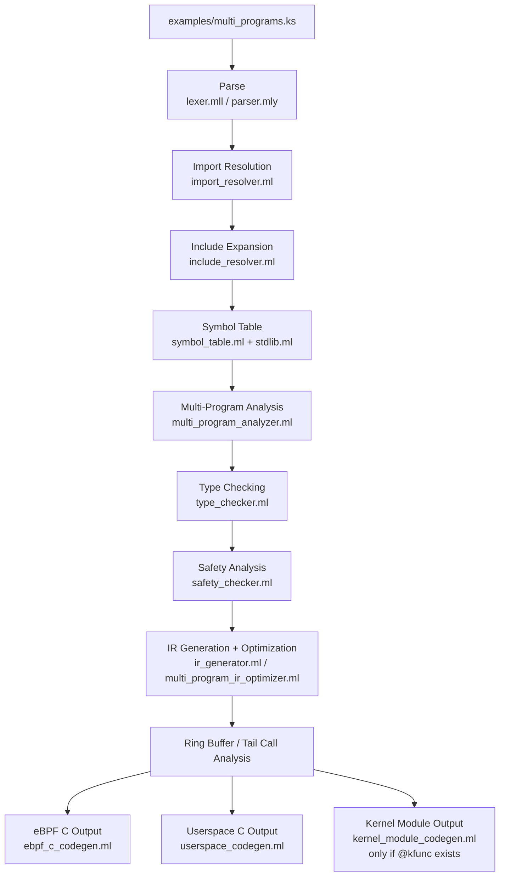

# KernelScript 语言与编译器架构拆解

本文面向已经拿到仓库、准备读源码的人，目标不是重复 README 的宣传语，而是回答三个更具体的问题：

1. KernelScript 这门语言到底抽象了什么。
2. 编译器从 `.ks` 源码到最终输出物经历了哪些阶段。
3. 每个核心源码文件在整个系统里扮演什么角色。

仓库里的实现整体上是一个“面向 eBPF 的多目标编译器”：同一份源码里可以同时描述 eBPF 程序、用户态协调逻辑、共享 map/config，以及可选的 kfunc 内核模块代码，编译器再把这些内容拆解并分别生成不同目标的 C 代码。

## 1. 语言模型

### 1.1 KernelScript 的核心目标

从 [README.md](README.md) 和 [SPEC.md](SPEC.md) 可以看出，KernelScript 的设计重点不是做一门通用语言，而是围绕 eBPF 开发里最麻烦的几个点做抽象：

- 同一工程里同时写 eBPF、userspace、kernel module 代码。
- 把 map、ring buffer、tail call、kfunc 这些 eBPF 机制提升成语言级概念。
- 用比原生 C 更强的静态约束，提前拦截 verifier 常见问题。
- 把多程序协同和程序生命周期管理纳入语言模型，而不是完全留给用户手写 libbpf 样板。

换句话说，KernelScript 不是“把 C 换个语法皮”，而是把 eBPF 开发流程本身编进了语言语义里。

### 1.2 顶层声明长什么样

从 [src/ast.ml](src/ast.ml) 和 [src/parser.mly](src/parser.mly) 可以看出，这门语言的顶层声明主要包括：

- attributed function：带属性的函数，例如 `@xdp`、`@tc`、`@helper`、`@kfunc`、`@test`
- regular function：普通函数，主要落到 userspace
- map declaration：全局 map 定义
- config declaration：共享配置块
- struct / enum / type alias：类型系统构件
- global variable：全局变量
- impl block：用于 struct_ops 这类内核接口实现
- import / include / extern kfunc：模块化与外部声明机制

这意味着 KernelScript 的源码组织是“平铺式”的，不强调复杂模块系统，而强调不同运行域的声明共存于同一编译单元。

### 1.3 作用域与执行域

语言里最重要的不是传统意义上的命名空间，而是“函数属于哪个执行域”：

- `@xdp`、`@tc`、`@tracepoint`、`@probe`：eBPF 入口函数
- `@helper`：供 eBPF 程序共享调用的内核侧辅助函数
- `@kfunc`：生成内核模块并注册给 eBPF 调用的函数
- 普通 `fn`：userspace 函数
- `@test`：测试模式下提升成测试入口的函数

这套模型直接影响类型检查、IR 降级和代码生成。例如 userspace 不能直接调用 kernel-only helper，`load/attach/detach` 这类 builtins 只在 userspace 有意义，而上下文参数与返回类型又会随程序种类变化。

### 1.4 类型系统的取舍

KernelScript 的类型系统刻意偏“保守”和“可验证”。在 [src/ast.ml](src/ast.ml) 里能看到：

- 基础整数类型：`u8/u16/u32/u64`、`i8/i16/i32/i64`
- `bool`、`char`、`void`
- 定长字符串 `str<N>`
- 定长数组 `T[N]`
- 指针 `*T`
- `struct`、`enum`、用户自定义类型
- `Option`、`Result`、函数类型
- `Map`、`ProgramRef`、`ProgramHandle`、`Ringbuf`、`RingbufRef`
- eBPF 上下文和动作类型，如 `xdp_md`、`xdp_action`

注意这里的设计不是追求复杂泛型，而是追求 verifier 友好：定长数组、简单别名、有限的运行时模型，都在降低生成代码被 verifier 拒绝的概率。

### 1.5 语言层面的关键能力

结合 [SPEC.md](SPEC.md)、[BUILTINS.md](BUILTINS.md)、[src/stdlib.ml](src/stdlib.ml) 和示例目录，可以把语言能力概括为几类：

- 多程序类型支持：XDP、TC、probe、tracepoint、struct_ops
- 共享状态：全局 map、config、全局变量
- 程序生命周期：`load`、`attach`、`detach`、`test`
- 用户态运行时：`dispatch`、`daemon`、`exec`
- 错误处理：`try/catch/throw`
- 模式匹配：`match`
- 动态对象：`new/delete`
- 模块化：`import` 导入 `.ks` 或 `.py`，`include` 导入 `.kh`
- 高级 eBPF 语义：tail call、ring buffer、kfunc、struct_ops

其中最有特色的是三点：

1. 程序是“一等对象”。语言能表达“先 load，再 attach”的生命周期约束。
2. 多目标编译是内建能力。同一份源码最终会拆成 eBPF C、userspace C、可选内核模块 C。
3. 一部分繁琐机制由编译器自动完成，例如 tail call 编排、ring buffer 协调、Python bridge、kfunc 模块装配。

## 2. 前端架构

### 2.1 词法与语法

前端从典型的 lexer/parser 结构开始：

- [src/lexer.mll](src/lexer.mll)：词法分析，负责 token 化、字符与数字字面量解析、位置信息维护。
- [src/parser.mly](src/parser.mly)：语法分析，定义声明、类型、表达式、语句、属性等具体语法。
- [src/parse.ml](src/parse.ml)：对外暴露 `parse_string` 和 `parse_file`，统一错误包装。

从 `parser.mly` 可以直接读出语法形状，比如：

- 语言是显式类型加局部推断的混合风格。
- 带属性函数是核心句法单元。
- `match`、`try/catch`、`defer`、`new` 等都已经进入正式语法，而不是后处理 hack。

### 2.2 AST 是中心数据结构

[src/ast.ml](src/ast.ml) 是整个编译器的枢纽。后续几乎所有阶段都围绕 AST 或其 typed AST 变体工作。它定义了：

- 源码位置 `position`
- 属性、程序类型、map 类型、BPF 类型
- 表达式、语句、函数、声明
- 程序定义、配置声明、impl block 等高层结构

如果要理解某个语义到底是“语言原生支持”还是“代码生成层补出来的”，先看 AST 里有没有独立节点，通常就能判断八成。

### 2.3 Import 与 Include 是两套机制

KernelScript 明确区分 import 和 include：

- [src/import_resolver.ml](src/import_resolver.ml)：处理 `.ks` 和 `.py` 模块导入，得到 `resolved_import`，既能带出 KernelScript 符号，也能记录 Python 模块桥接信息。
- [src/include_resolver.ml](src/include_resolver.ml)：处理 `.kh` 头文件展开，只允许声明，不允许实现体，最后把 include 扁平化进 AST。

这套拆分很合理：

- import 更像“模块依赖”
- include 更像“头文件声明注入”

因此，编译器在真正做类型检查之前，会先做 import 解析和 include 展开，把编译单元补齐。

## 3. 语义分析与静态检查

### 3.1 符号表先建立全局视图

在 [src/main.ml](src/main.ml) 的 `compile_source` 里，解析之后首先会构建符号表。符号表由 [src/symbol_table.ml](src/symbol_table.ml) 负责，作用包括：

- 收集类型、函数、map、config、全局变量
- 注入内建类型信息
- 为后续类型检查、IR 生成提供统一查询入口

这里还会把 [src/stdlib.ml](src/stdlib.ml) 里的内建类型声明一起喂给符号表。

### 3.2 多程序分析是 KernelScript 的特色前置阶段

[src/multi_program_analyzer.ml](src/multi_program_analyzer.ml) 不是传统编译器都会有的模块，但对 KernelScript 非常关键。它会从 AST 提取多个 eBPF 程序，分析：

- 不同程序的执行上下文
- 全局 map 的共享访问情况
- 潜在冲突与协同机会
- 顺序执行与并发执行关系

它反映了 KernelScript 的一个核心事实：输入不是“单程序源码”，而更像“一个由多个 eBPF 程序和用户态协调逻辑组成的系统描述”。

### 3.3 类型检查不只是做类型匹配

[src/type_checker.ml](src/type_checker.ml) 是前端最关键的语义模块。它输出的是带类型标注的 AST，而不是简单通过/失败。这里做的事情明显超出传统表达式类型推断：

- 普通表达式与语句类型检查
- 函数作用域与执行域约束
- attributed function 的调用规则检查
- helper / test / attributed function 的专门登记
- map、config、imports 的语义接入
- tail call 场景识别
- `match`、`try/catch`、对象分配等高级结构检查

也就是说，type checker 既承担语言类型系统的职责，也承担大量“eBPF 领域规则”的静态守门职责。

### 3.4 安全分析是独立的一道闸

完成类型检查后，编译器还会跑一轮专门的安全分析：[src/safety_checker.ml](src/safety_checker.ml)。

它关注的不是“类型对不对”，而是“是否可能违反 eBPF 的运行时和 verifier 约束”，例如：

- 栈使用量是否超限
- 数组或字符串索引是否越界
- 指针是否存在空指针或非法访问风险
- map 操作是否安全

这一步的意义很大，因为很多 eBPF 问题在 C 编译阶段不会报错，但会在 verifier 阶段失败。KernelScript 尝试把一部分这类问题前移到自己的编译期。

### 3.5 运行时求值器的定位

[src/evaluator.ml](src/evaluator.ml) 提供了一个语言级 evaluator，支持运行时值、map 存储、内存区域、指针模型和部分 builtin 行为模拟。它更像：

- 解释执行支撑
- 语义验证工具
- 某些测试或分析能力的基础设施

它不是主编译流水线的中心阶段，但体现出项目并不只是“源码转字符串”的 code generator，而是在尝试维护一套较完整的语言运行时语义模型。

## 4. 中间表示与中端分析

### 4.1 IR 的设计目标

[src/ir.ml](src/ir.ml) 定义了 KernelScript 的中间表示。这个 IR 的目标不是做 SSA 或 LLVM 那种通用优化框架，而是作为 AST 与多后端之间的桥梁，服务于：

- 多程序系统表示
- userspace / eBPF / kernel 共享的统一中间层
- 控制流和资源分析
- 后端代码生成

`ir_multi_program` 很能说明问题：一个编译单元会包含 userspace program、多个 eBPF programs、ring buffer registry、按源码顺序保留的 source declarations。

这说明编译器的中间层建模对象仍然是“系统级编译单元”，而不是单个函数。

### 4.2 AST 到 IR 的降级

[src/ir_generator.ml](src/ir_generator.ml) 负责从 typed AST 降级到 IR，里面能看到几个很明确的职责：

- 表达式与语句降级
- 基本块与控制流拼装
- map 操作降级
- safety check 注入
- builtins 扩展
- 循环信息和常量环境跟踪

这里的 `ir_context` 维护了相当多的编译期状态，例如：

- 当前 block
- 临时变量编号
- stack usage
- helper function 集合
- 全局变量、函数参数、map 来源变量
- 是否在 userspace、try block、bpf_loop callback 中

这表明 IR 生成器已经承接了相当多的 lowering 逻辑，不是纯粹的机械翻译。

### 4.3 中端分析模块是按主题拆开的

仓库里与 IR 或中端相关的模块不少，基本是按专项问题拆分：

- [src/ir_analysis.ml](src/ir_analysis.ml)：通用 IR 分析，以及 ring buffer registry 填充
- [src/loop_analysis.ml](src/loop_analysis.ml)：循环分析
- [src/tail_call_analyzer.ml](src/tail_call_analyzer.ml)：tail call 检测与索引分配
- [src/map_assignment.ml](src/map_assignment.ml)：map 赋值优化/语义处理
- [src/map_operations.ml](src/map_operations.ml)：map 操作模型、并发与性能特征
- [src/ir_function_system.ml](src/ir_function_system.ml)：函数签名验证

这些模块共同说明一个事实：KernelScript 的优化与分析重点不在传统代数优化，而在 eBPF 相关约束、资源和调用模式的正确性处理。

### 4.4 多程序优化器本质上是系统级协调器

[src/multi_program_ir_optimizer.ml](src/multi_program_ir_optimizer.ml) 名字叫 optimizer，但它做的不只是性能优化，还包括：

- 基线 IR 生成
- 函数签名校验
- 从多程序分析结果生成策略
- 跨程序约束验证
- 资源规划

它更像“中端总控器”。在当前实现里，一些优化策略还偏启发式，但架构意图非常清楚：KernelScript 想在“多 eBPF 程序协同”这一层做系统级编译决策。

## 5. 后端与输出物

### 5.1 eBPF C 后端

[src/ebpf_c_codegen.ml](src/ebpf_c_codegen.ml) 是最核心的后端之一，负责把 IR 变成可被 `clang -target bpf` 编译的 C。它的关键工作包括：

- 生成 `SEC("...")` 段标记
- 生成 map 定义
- 生成 helper 调用
- 把 IR 控制流还原成结构化 C
- 处理 dynptr / ring buffer / map 值等内存区域语义
- 接入 tail call 分析结果

可以把它理解为“面向 verifier 的 C pretty printer”，但内部其实嵌入了不少 eBPF 特有的语义选择逻辑。

### 5.2 上下文专用代码生成器

不同程序类型的上下文访问规则不一样，所以仓库在 [src/context](src/context) 下单独拆了一层 context codegen，比如：

- [src/context/xdp_codegen.ml](src/context/xdp_codegen.ml)
- [src/context/tc_codegen.ml](src/context/tc_codegen.ml)
- [src/context/kprobe_codegen.ml](src/context/kprobe_codegen.ml)
- [src/context/tracepoint_codegen.ml](src/context/tracepoint_codegen.ml)
- [src/context/fprobe_codegen.ml](src/context/fprobe_codegen.ml)

这一层负责：

- 上下文字段映射
- 头文件选择
- section 名称生成
- 程序类型相关常量映射

这样做避免把所有 program-type 细节都堆进单个后端文件里。

### 5.3 Userspace C 后端

[src/userspace_codegen.ml](src/userspace_codegen.ml) 负责生成用户态协调程序。它不是简单输出一个 `main`，而是要承担完整的 eBPF 管理职责，例如：

- skeleton / loader 协调
- 程序加载和附着
- map 管理
- ring buffer 事件分发
- Python import bridge
- kfunc 依赖分析后的模块装配

这说明 userspace 在 KernelScript 里不是“附属品”，而是与 eBPF 一起被统一编译的第一类目标。

### 5.4 Kernel Module 后端

[src/kernel_module_codegen.ml](src/kernel_module_codegen.ml) 专门处理 `@kfunc`。如果源码里声明了 kfunc，编译器会额外生成 `.mod.c`，用于：

- 导出内核函数实现
- 生成 kfunc 注册逻辑
- 接入 eBPF 子系统所需的模块样板

这让 KernelScript 能把“eBPF 程序 + 可调用的内核扩展函数”放在同一源码和同一编译流程里。

## 6. 实际编译流水线

最值得读的入口是 [src/main.ml](src/main.ml) 里的 `compile_source`。按当前实现，编译顺序大致如下：

1. 解析源码，得到 AST。
2. 解析 import，识别 `.ks` 和 `.py` 依赖。
3. 处理 include，把 `.kh` 声明扁平化进 AST。
4. 创建输出目录，并预处理 imported modules / Python 文件。
5. 构建符号表，并接入 builtin types。
6. 执行多程序分析。
7. 执行类型检查，得到 annotated AST。
8. 执行安全分析，拦截 stack / bounds / pointer 等问题。
9. 测试模式下生成独立 test C 文件。
10. 生成并优化 IR。
11. 做 ring buffer 分析与 tail call 分析。
12. 生成 eBPF C。
13. 分析 kfunc 依赖并生成 userspace C。
14. 如有 `@kfunc`，再生成 kernel module C。
15. 如启用 Makefile 输出，再补齐构建脚本。

这是 KernelScript 最重要的结构特征：它不是“单后端编译器”，而是一个编译入口驱动多个输出工件的 orchestrator。

### 6.1 典型输出物

对一个 `foo.ks`，编译结果通常会包含：

- `foo.ebpf.c`：eBPF 侧 C 代码
- `foo.c`：userspace 协调程序
- `foo.mod.c`：可选，kfunc 内核模块
- `foo.test.c`：可选，测试模式输出
- `Makefile`：可选，构建脚本
- 导入模块对应的 `.c` / `.so` 或 Python 文件拷贝

因此，KernelScript 更像 source-to-source compiler 加工程脚手架生成器的组合。

### 6.2 Mermaid 总览图

先看一张抽象版总图，表示 KernelScript 编译器如何把单个 `.ks` 编译单元拆成多个阶段和多个目标：



如果只记一件事，就记这张图表达的结论：KernelScript 编译器处理的不是“一个函数”，而是“一个包含多类声明和多目标产物的系统级编译单元”。

### 6.3 从一个 example 出发的调用链导读

最适合当样本的是 [examples/multi_programs.ks](examples/multi_programs.ks)。它同时包含：

- `include "xdp.kh"` 和 `include "tc.kh"`
- 一个共享 map `shared_counter`
- 一个 `@xdp` 入口 `packet_counter`
- 一个 `@tc("ingress")` 入口 `packet_filter`
- 一个 userspace `main`

也就是说，这个文件天生就横跨了 KernelScript 最核心的三类对象：共享状态、多个 eBPF 程序、userspace 协调逻辑。

先看结构图：

```mermaid
flowchart LR
    subgraph S[examples/multi_programs.ks]
        A[include xdp.kh / tc.kh]
        B[pin var shared_counter]
        C[@xdp packet_counter]
        D[@tc ingress packet_filter]
        E[fn main]
    end

    A --> F[Expanded declarations]
    B --> G[Shared global map]
    C --> H[eBPF program 1]
    D --> I[eBPF program 2]
    E --> J[Userspace coordinator]

    G --> H
    G --> I
    G --> J

    H --> K[foo.ebpf.c sections]
    I --> K
    J --> L[foo.c loader / attach / detach]
```

再按实际调用链看它如何被编译。

#### 第一步：Parse

入口在 [src/main.ml](src/main.ml#L610)，真正开始解析源码的位置在 [src/main.ml](src/main.ml#L624)。这里会读取 `multi_programs.ks` 文件内容，交给 [src/lexer.mll](src/lexer.mll) 和 [src/parser.mly](src/parser.mly) 生成 AST。

在这一阶段，这个 example 里的内容会先被识别成几个顶层声明：

- 两个 include 声明
- 一个 map 声明
- 两个 attributed function
- 一个普通函数 `main`

这一步只回答“语法是否合法”，还不关心 `packet_counter` 和 `packet_filter` 能不能真正编译成合法 eBPF。

#### 第二步：Import / Include 补全编译单元

`multi_programs.ks` 没有 import，但编译器依然会统一经过 import 解析入口 [src/main.ml](src/main.ml#L650)。随后在 [src/main.ml](src/main.ml#L665) 调用 [src/include_resolver.ml](src/include_resolver.ml)，把 `xdp.kh` 和 `tc.kh` 展开进当前 AST。

这一步的作用是把上下文类型、常量和 extern 声明补齐，否则后面的类型检查无法理解：

- `xdp_md`
- `__sk_buff`
- `XDP_PASS`
- `TC_ACT_OK`

所以可以把 include 理解为“把 eBPF 上下文知识注入当前编译单元”。

#### 第三步：建立符号表

在 [src/main.ml](src/main.ml#L759)，编译器会调用 [src/symbol_table.ml](src/symbol_table.ml) 构建符号表，同时把 [src/stdlib.ml](src/stdlib.ml) 里的 builtin types 也并入当前上下文。

对这个 example 来说，符号表里最关键的几类符号是：

- map：`shared_counter`
- eBPF 入口：`packet_counter`、`packet_filter`
- userspace 函数：`main`
- builtins：`load`、`attach`、`detach`、`print`
- include 展开的上下文类型与动作常量

这时编译器才第一次拥有“全局视图”。

#### 第四步：多程序分析

在 [src/main.ml](src/main.ml#L766)，编译器调用 [src/multi_program_analyzer.ml](src/multi_program_analyzer.ml)。对这个 example，这一步很关键，因为它不是单程序：

- `packet_counter` 被识别为 XDP 程序
- `packet_filter` 被识别为 TC 程序
- `shared_counter` 被识别为共享全局 map
- 分析器会记录两个程序都依赖同一个共享状态

这是 KernelScript 跟普通“单文件转 C”编译器非常不同的地方。它在这一层已经开始把源码当成“多程序系统”而不是“一个入口函数”。

#### 第五步：类型检查

在 [src/main.ml](src/main.ml#L778)，编译器调用 [src/type_checker.ml](src/type_checker.ml)。对这个 example，类型检查的重点包括：

- `packet_counter` 的参数是否真的是 `*xdp_md`
- `packet_counter` 的返回值是否兼容 `xdp_action`
- `packet_filter` 的参数是否兼容 `*__sk_buff`
- `packet_filter` 的返回值是否兼容 `i32`
- `main` 中的 `load(packet_counter)` 和 `load(packet_filter)` 是否把 attributed function 当成合法 program 引用
- `attach` / `detach` 的调用位置是否在 userspace 合法
- `shared_counter[1] = 100` 这类 map 写入是否类型一致

这一步做完后，编译器得到的是带类型标注的 AST，不再只是纯语法树。

#### 第六步：安全分析

在 [src/main.ml](src/main.ml#L812)，编译器进入 [src/safety_checker.ml](src/safety_checker.ml)。对这个样本来说，它不会像复杂包解析例子那样触发很多边界检查，但仍会统一验证：

- 栈使用是否超限
- map 访问是否安全
- 是否出现明显的非法指针风险

这个阶段的意义是：哪怕类型正确，仍然可能因为 eBPF 约束而不安全，编译器会尽量在这里前置报错。

#### 第七步：IR 生成与系统级优化

在 [src/main.ml](src/main.ml#L879)，编译器调用 [src/multi_program_ir_optimizer.ml](src/multi_program_ir_optimizer.ml)，内部再落到 [src/ir_generator.ml](src/ir_generator.ml) 生成 IR。

对这个 example，IR 层会发生几件事：

- `packet_counter` 和 `packet_filter` 变成两个独立 eBPF program IR
- `main` 变成 userspace program IR
- `shared_counter` 变成所有目标都能引用的共享 map 定义
- 两个 eBPF 程序和 userspace 协调逻辑被打包进同一个 `ir_multi_program`

这一步之后，源码中“同一个文件里的多类声明”被正式拆成了“多个后端可消费的中间对象”。

#### 第八步：后处理分析

在生成最终代码前，编译器还会做 ring buffer 和 tail call 相关分析。这个 example 本身没有 ring buffer 和 tail call，但它依然会统一经过这条后处理链。这样做的好处是：

- 简单程序不需要特殊分支
- 复杂程序可以共享同一套后端流程

#### 第九步：生成 eBPF C

在 [src/main.ml](src/main.ml#L918)，编译器调用 [src/ebpf_c_codegen.ml](src/ebpf_c_codegen.ml)。

对这个 example，结果不会生成两个独立 `.ebpf.c` 文件，而是通常生成一个聚合后的 eBPF C 文件，里面包含：

- `packet_counter` 对应的 XDP section
- `packet_filter` 对应的 TC section
- `shared_counter` 对应的 map 定义

也就是说，源码里的“两个 eBPF 程序 + 一个共享 map”在后端会落成同一个 eBPF 编译单元里的多 section 输出。

#### 第十步：生成 userspace C

在 [src/main.ml](src/main.ml#L929)，编译器调用 [src/userspace_codegen.ml](src/userspace_codegen.ml)。

对这个 example，`main` 里的语义会被翻译成 userspace 协调代码，大致包括：

- 初始化 loader / skeleton
- 加载 `packet_counter`
- 加载 `packet_filter`
- 将两个程序 attach 到目标接口
- 最后按逻辑 detach

所以这个 example 里的 `main` 不是被“原样保留”，而是被编译进一个带 libbpf 协调职责的 userspace C 程序。

#### 第十一步：决定是否生成内核模块

如果样本里有 `@kfunc`，编译器还会继续走 [src/kernel_module_codegen.ml](src/kernel_module_codegen.ml) 生成 `.mod.c`。但 [examples/multi_programs.ks](examples/multi_programs.ks) 没有 `@kfunc`，因此这一支不会产生产物。

#### 最终你会得到什么

如果把这个 example 真正编译出来，可以把产物理解成两部分：

- 一个 eBPF C 编译单元，内部含 XDP 和 TC 两个 section，以及共享 map
- 一个 userspace C 编译单元，负责加载、附着、运行和卸载这些程序

这正是这个 example 最适合拿来读调用链的原因：它几乎是 KernelScript “单文件描述一个 eBPF 系统”这一设计目标的最小完整样本。

## 7. 源码阅读地图

如果要系统读懂这个项目，建议顺序如下：

1. [SPEC.md](SPEC.md)
2. [src/ast.ml](src/ast.ml)
3. [src/lexer.mll](src/lexer.mll) 和 [src/parser.mly](src/parser.mly)
4. [src/main.ml](src/main.ml)
5. [src/type_checker.ml](src/type_checker.ml)
6. [src/multi_program_analyzer.ml](src/multi_program_analyzer.ml)
7. [src/safety_checker.ml](src/safety_checker.ml)
8. [src/ir.ml](src/ir.ml) 和 [src/ir_generator.ml](src/ir_generator.ml)
9. [src/tail_call_analyzer.ml](src/tail_call_analyzer.ml)、[src/ir_analysis.ml](src/ir_analysis.ml)
10. [src/ebpf_c_codegen.ml](src/ebpf_c_codegen.ml)、[src/userspace_codegen.ml](src/userspace_codegen.ml)、[src/kernel_module_codegen.ml](src/kernel_module_codegen.ml)
11. examples 和 tests 目录

其中：

- `examples` 最适合理解语言表面能力。
- `tests` 最适合理解边界条件和编译器作者真正关心的约束。

## 8. 这个架构最值得注意的地方

### 8.1 它本质上是“系统编译器”

大多数语言编译器默认输入是一个程序，输出是一个目标文件或二进制。KernelScript 的输入更像一个系统描述：

- 若干 eBPF 程序
- 用户态控制逻辑
- 共享 map / config
- 可选内核扩展

所以它的分析和 IR 设计天然带有“多组件协同”的味道。

### 8.2 它把 eBPF 领域约束前移到了编译器中

相比把所有问题都留给 clang、libbpf 和 verifier，KernelScript 在自己的前端和中端里提前做了：

- 执行域约束
- 生命周期语义
- 安全分析
- map / ring buffer / tail call 语义识别
- 上下文相关函数签名校验

这正是这门语言相对“eBPF C 宏封装”的真正差异所在。

### 8.3 当前实现已经具备清晰的分层，但还在演进中

从源码能看出，项目已经形成了比较明确的层次：

- 前端：lexer / parser / AST / import / include / type checker
- 分析层：multi-program / safety / loop / tail call / map analysis
- 中间层：IR
- 后端：eBPF / userspace / kernel module / context-specific codegen

同时也能看出它仍在快速演进：一些优化策略偏启发式，一些模块兼具“分析 + 编排”职责，还没有完全收敛成更纯粹的编译框架。这对读源码的人是好事，因为现阶段架构意图比抽象包装更直接。

## 9. 一句话总结

KernelScript 可以理解为一门面向 eBPF 系统开发的 DSL，它的编译器不是只把语法翻译成 C，而是在编译过程中主动承担了多程序协同、执行域隔离、安全检查、tail call 编排、userspace 协调和 kfunc 模块生成这些领域职责。

如果从“语言实现”角度看，这个项目最有意思的地方不只是语法，而是它把 eBPF 开发中原本分散在 libbpf 样板、内核约束和工程脚本里的知识，尽可能集中收编进了编译器本身。
